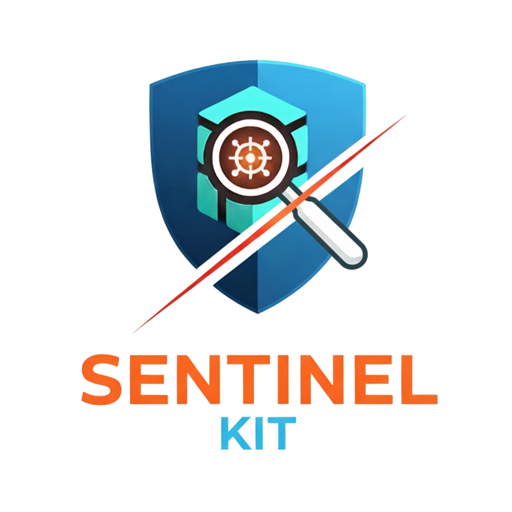
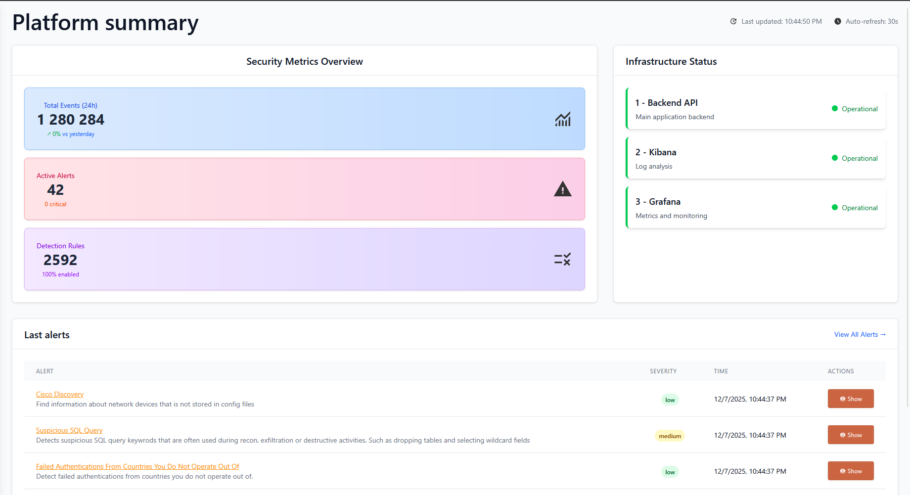

# 🛡️ Sentinel Kit: Unified security platform for SOC & DFIR

**Sentinel Kit** is a comprehensive security platform designed to provide **Security Operations Center (SOC)** and **Digital Forensics and Incident Response (DFIR)** capabilities with unparalleled deployment simplicity.

Built for **real-time security monitoring**, **threat detection**, and **incident response**, this integrated platform enables collection, analysis, detection, and immediate response to security threats.



---

## ✨ Core Capabilities

Sentinel Kit provides a complete security monitoring and response ecosystem:

### 🔍 **Real-Time Threat Detection**
* **Sigma Rules Engine**: Advanced detection rules for log-based threat hunting
* **Alert Management**: Real-time alert processing and triage workflow
* **Custom Detection Logic**: Create and manage custom detection rules

### 📊 **Security Monitoring & Analytics**
* **Unified Dashboard**: Centralized security metrics and KPIs
* **Data Source Monitoring**: Track log ingestion and data source health
* **Service Health Monitoring**: Platform component status and performance

### 📁 **Log Collection & Analysis**
* **Multi-Source Ingestion**: FluentBit-based log collection from various sources
* **Elasticsearch Storage**: Scalable log storage and indexing
* **Advanced Search**: Powerful querying and filtering capabilities

### 🎯 **Integrated Analysis Tools**
* **Native Alert Viewer**: Built-in alert analysis and investigation tools
* **Kibana Integration**: Advanced log exploration and custom dashboards
* **Grafana Dashboards**: Infrastructure monitoring and metrics visualization

---

## 🚀 Quick Start

### Prerequisites

- **Operating System**: Windows 10/11, Linux, or macOS
- **Docker & Docker Compose** (or Docker Desktop)
- **Memory**: Minimum 8 GB RAM (16 GB recommended)
- **Storage**: At least 20 GB free disk space
- **Network**: Internet access for initial container downloads

### One-Command Deployment

1. **Clone and Start:**
   ```bash
   git clone https://github.com/codeyourweb/sentinel-kit.git
   cd sentinel-kit
   
   # Windows PowerShell
   ./launcher.ps1 build
   
   # Linux/macOS
   ./launcher.sh build
   ```

   After an initial build. Startup could be done with `start` command

2. **Configure DNS (Local Development):**
   Use the integrated console command as __Administrator__:
   ```bash
   ./launcher.sh local-dns-install
   ```

   Or, manually add to your hosts file :
   ```
    127.0.0.1   sentinel-kit.local
    127.0.0.1   backend.sentinel-kit.local
    127.0.0.1   phpmyadmin.sentinel-kit.local
    127.0.0.1   kibana.sentinel-kit.local
    127.0.0.1   grafana.sentinel-kit.local
   ```

3. **Access the Platform:**
   - **Main Dashboard**: https://sentinel-kit.local
   - **Kibana**: https://kibana.sentinel-kit.local  
   - **Grafana**: https://grafana.sentinel-kit.local

### First Steps
1. [Configure and create an admin user](docs/01-getting-started.md)
2. [Add new data sources and ingest logs](docs/02-data-ingestion.md)
3. [Create detection rules](docs/04-sigma-rules.md)
4. [Monitor and analyze alerts](docs/05-alert-management.md)

## 🏗️ Architecture Overview

Sentinel Kit follows a microservices architecture with the following core components:

| Component | Purpose | Technology Stack |
|-----------|---------|------------------|
| **Web Interface** | Main dashboard and management console | Vue.js, Nginx |
| **Backend API** | Core business logic and data management | PHP Symfony, PHP-FPM |
| **Detection Engine** | Sigma rules processing and alert generation | Elastalert, Python |
| **Log Storage** | Centralized log repository and indexing | Elasticsearch |
| **Log Ingestion** | Multi-source log collection and forwarding | FluentBit |
| **Database** | Platform configuration and user management | MySQL |
| **Monitoring** | Infrastructure metrics and dashboards | Prometheus, Grafana |
| **Service Discovery** | Reverse proxy and SSL termination | Caddy |

---

## 📚 Documentation

### User Guides
* [Getting Started](docs/01-getting-started.md) - Initial setup and first admin user creation
* [Data Ingestion](docs/02-data-ingestion.md) - Configure log sources and data collection
* [Sigma Rules Management](docs/04-sigma-rules.md) - Create and manage detection rules
* [Alert Management](docs/05-alert-management.md) - Investigation and response workflows
* [Monitoring & Health](docs/06-monitoring-health.md) - Platform monitoring and troubleshooting

---

## 🔄 Management Commands

The included launcher provides simplified platform management:

```powershell
=============================================
       Sentinel-Kit Management Script        
=============================================

USAGE:
  .\launcher <command>

COMMANDS:
  start               Start the Docker stack
  stop                Stop the running Docker stack
  build               Build and start the Docker stack
  clean-data          Clean all user data and stop containers
  console             Access Sentinel-Kit console
  logs                Show Docker container logs
  status              Show container status
  local-dns-install   Install local DNS entries to hosts file
  local-dns-uninstall Remove local DNS entries from hosts file
  help                Show this help message

OPTIONS:
  -Follow     Follow log output (for logs command)
```

---

## 🛟 Support & Community

* **Documentation**: Complete guides available in the [docs/](docs/) directory
* **Issues**: Report bugs via GitHub Issues
* **Discussions**: Community support and feature discussions
* **Security Issues**: Report security vulnerabilities privately

---

## 📄 License

This project is licensed under the **GNU AFFERO GENERAL PUBLIC LICENSE**. See [LICENSE](LICENSE) for details.

---

## 🙏 Acknowledgments

* **Sigma Project** for the detection rule format and community rules
* **Elastic Stack** for the powerful search and analytics engine
* **FluentBit** for efficient and lightweight log processing
* **Vue.js Community** for the reactive frontend framework
* **Symfony** for this powerfull PHP framework, core of Sentinel-Kit backend
---

*Sentinel Kit - Simplifying Security Operations through Unified Platform Management*