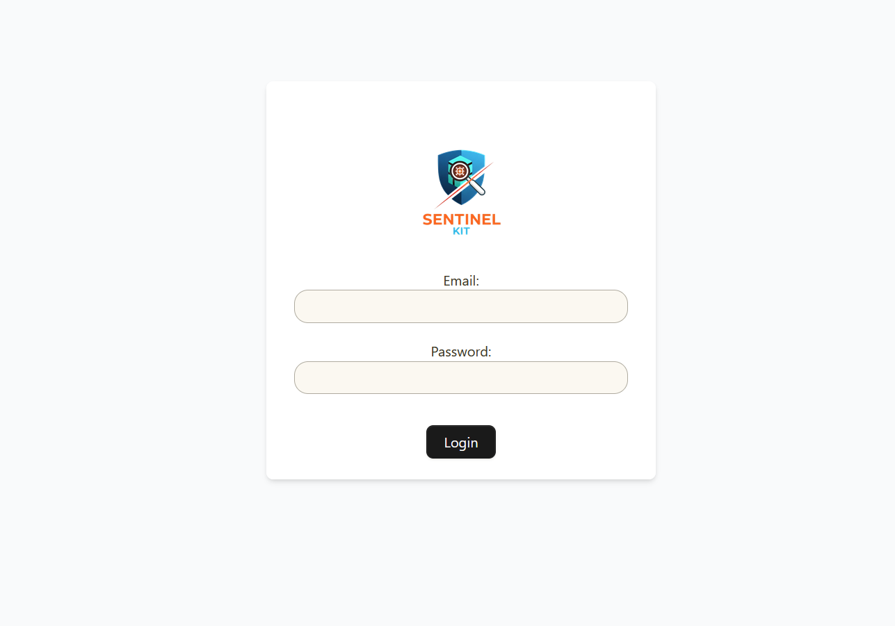

# Sentinel-Kit quick start

## ⚠️ Security warning
Although the code in this stack is designed to be secure in terms of authentication and client/server exchanges (strong identification, certificates, JWT, etc.), it is your responsibility to limit the server's exposure (flow filtering, whitelisting, etc.). No filtering mechanism is provided in the project, so configure your flows to limit exposure as follows:


**Exposed services:**
| **Web API** | Used for clients<->server communications and admin actions over the web interface | 
| **SFTP Server** | Secure file/evidence upload | 

optional - for interoperability purpose with a forwarder like logstash / winlogbeat / fluentbit etc... It could also be done over Web API (see documentation)
| **Syslog forwarder** | Fluentbit log forwarder to elasticsearch 

**Admin access** 
| **Web front end** | Access to the admin application (agents control, log analysis...) |

**Admin extended features**
| **PhpMyAdmin** | MySQL database management | 
| **Grafana** | Monitoring dashboards (fluentbit forwarder logs / elasticsearch ingestion / stack health)
| **Kibana** | Kibana complete access (for advanced usage only. Standard features are directly implemented in the admin web interface) 

## Prerequisites
This project is designed to be deployed in minutes using Docker Compose.
* **Docker**
* **Docker Compose** (or Docker Engine including Compose)
* Minimum **8 GB of RAM** (essential for Elasticsearch)

## 🚀 Let's start Sentinel-Kit
Everything comes as a full docker-compose stack to avoid configuration and depencies and simplify the deployment. 

First, clone sentinel kit repository 
```bash
git clone 
cd sentinel-kit
```

Then, in a local environment, you need to define the following DNS entries: 
```bash
# OS `hosts` file
127.0.0.1   sentinel-kit.local
127.0.0.1   backend.sentinel-kit.local
127.0.0.1   phpmyadmin.sentinel-kit.local
127.0.0.1   kibana.sentinel-kit.local
127.0.0.1   grafana.sentinel-kit.local
```

On advanced configuration, you can configure `config/caddy_server/Caddyfile` if you want to set your own nameserver. If so, you will also need to set your hostname, replacing the original ones in `.env` file. You can find details about advanced configuration [here](02-customize-stack.md).

When your DNS configuration is ok. Start the stack with: 
```bash
    docker-compose up -d
```
Initial startup could be long as elastic configure two nodes and kibana. 

Caddy server will generate a complete certification chain for the exposed services (frontend, backend, phpmyadmin, kibana, grafana). If you don't want to always accept untrusted certification chains, add root and intermediate CA to your browser certificates. They are located in ./config/certificates/caddy_server

https://sentinel-kit.local should return the following page:


And, that's all, you are good to go!

## 🛑 Stopping and Cleaning the Stack

To stop and remove the containers, networks, and volumes created by Docker Compose:

```bash
docker-compose down -v
```

If you want to erase all user data, and start from a fresh and clean installation, there is a `clean-user-data` sh or powershell (depending on your OS) to help you erasing all personal data. Then, you can rebuild the whole stack with: 

```bash
docker-compose up --build --force-recreate
```