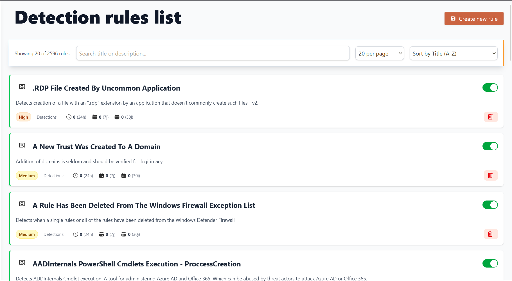

# 🎯 Sigma Rules Management

This guide covers creating, managing, and deploying Sigma detection rules in Sentinel Kit for automated threat detection.

---

## Understanding Sigma Rules

**Sigma** is a standard format for writing detection rules that work across different SIEM platforms. In Sentinel Kit, Sigma rules are converted to Elasticsearch queries and processed by Elastalert.

### Rule Lifecycle
```
Create/Edit → Validate → Deploy → Monitor → Update
```

### Rule Components
- **Detection Logic**: Search conditions and filters
- **Metadata**: Title, description, references, tags
- **False Positive Handling**: Exceptions and filtering
- **Alert Configuration**: Severity, notification settings

---

## Accessing Rule Management

### Via Dashboard Interface

1. **Navigate to Rules:**
   - Main Dashboard → Sigma Rules
   - View all active and inactive rules
   - Check rule status and last execution

2. **Rule Categories:**
   - **Active Rules**: Currently deployed and monitoring
   - **Draft Rules**: In development or testing
   - **Community Rules**: Imported from Sigma community
   - **Custom Rules**: Organization-specific detections

---

## Creating Your First Rule

### Using the Rule Editor



1. **Access Rule Creation:**
   - Dashboard → Sigma Rules → "Create New Rule"
   - Choose from template or start blank
   - Select rule category and severity

2. **Basic Rule Structure:**
```yaml
title: Failed Login Attempts Detection
id: 12345678-1234-1234-1234-123456789abc
status: experimental
description: Detects multiple failed login attempts from same source
references:
    - https://attack.mitre.org/techniques/T1110/
author: Security Team
date: 2024/01/01
tags:
    - attack.credential_access
    - attack.t1110
logsource:
    category: authentication
    product: web_application
detection:
    selection:
        event_type: 'login_failed'
        source_ip: '*'
    condition: selection | count(source_ip) > 5
    timeframe: 5m
falsepositives:
    - User entering wrong password multiple times
level: medium
```

### Rule Editor Features

**Syntax Highlighting:** Real-time Sigma syntax validation
**Field Suggestions:** Auto-complete for log fields
**Preview Mode:** Test rule logic before deployment
**Version Control:** Track rule modifications and history

---

## Rule Components Explained

### Title and Metadata
```yaml
title: "Descriptive Rule Name"
id: "unique-uuid-identifier" 
status: "stable|test|experimental"
description: "What this rule detects and why it matters"
author: "Rule creator or team name"
date: "2024/01/01"
modified: "2024/01/15"
```

### Log Source Definition
```yaml
logsource:
    category: "authentication|process_creation|network_connection"
    product: "windows|linux|apache|nginx"
    service: "security|application|system"
```
---

## Next Steps

With Sigma rules deployed:

1. **[Monitor and Investigate Alerts](04-alert-management.md)** - Learn alert triage workflows
2. **[Platform Health Monitoring](06-monitoring-health.md)** - Monitor rule performance

---

*Next: [Alert Management & Investigation →](04-alert-management.md)*
<<[Back to index](index.md)