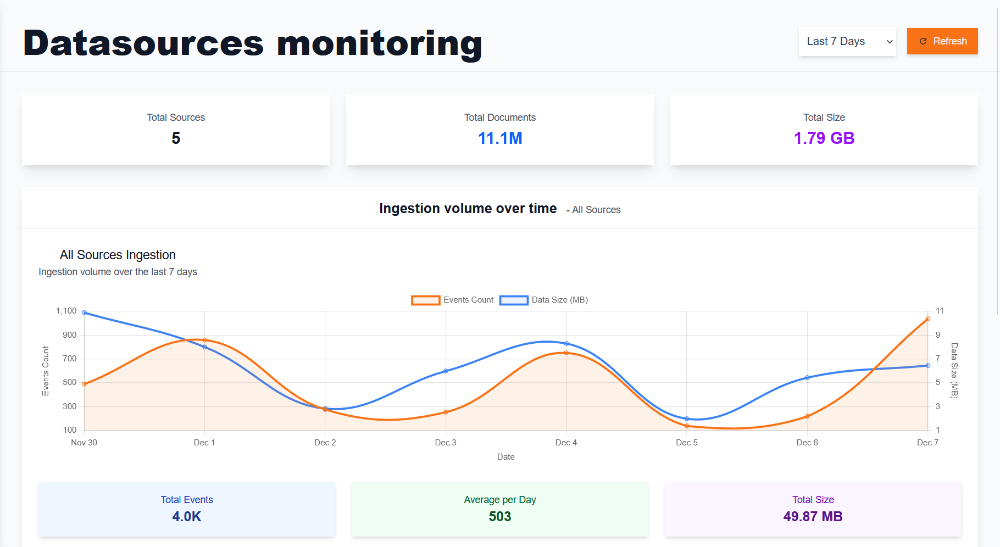
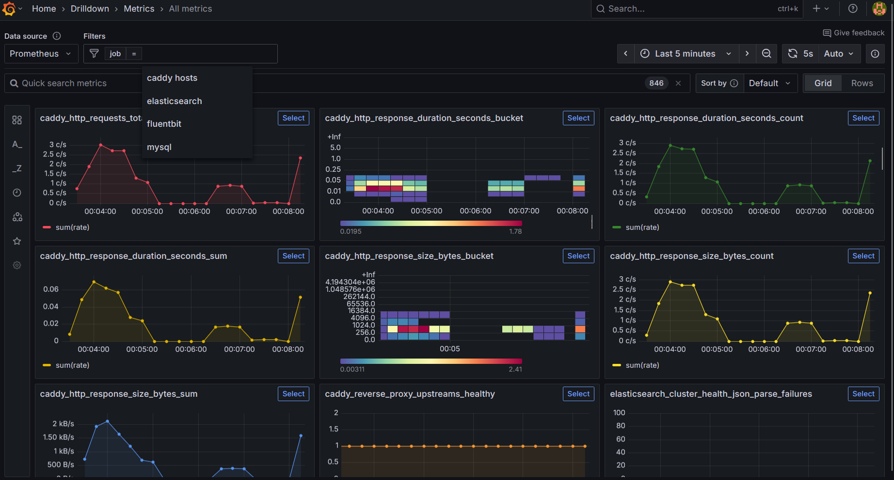

# 📊 Monitoring & Health

This guide covers comprehensive monitoring of Sentinel Kit components, performance optimization, and health management.

---

## Overview

Sentinel Kit provides multi-layered monitoring through integrated tools and dashboards:

- **Real-time Service Health**: Component status and availability
- **Performance Metrics**: Resource usage and processing rates  
- **Log Ingestion Monitoring**: Data flow and processing health
- **Security Operations Metrics**: Alert generation and response times
- **Infrastructure Monitoring**: System resources and capacity

---

## Stack Health Monitoring

### Service Status Panel

The main dashboard provides real-time service health:

**Component Status Indicators:**
- 🟢 **Healthy**: Service running normally
- 🟡 **Warning**: Performance degraded or approaching limits  
- 🔴 **Critical**: Service unavailable or failing
- ⚫ **Unknown**: Unable to determine status

**Monitored Services:**
- Frontend (Vue.js application)
- Backend API (Symfony application)
- Elasticsearch (search and storage)
- MySQL (configuration database)
- FluentBit (log collection)
- Caddy (reverse proxy)
- Grafana (metrics visualization)

To check service health, just use console app:
```bash
./launcher status
```

## Logs ingestion monitoring
Go to Sentinel-Kit datasources menu (https://sentinel-kit.local/datasources by default)


## Services Performance Metrics

Sentinel Kit includes a set of monitoring services that are enabled when the `internal-monitoring` profile is added to your `COMPOSE_PROFILES` in the `.env` file. These services rely on Prometheus, which is queried by Grafana.

**Key Performance Indicators:**
- **Alert Processing Time**: Time from log ingestion to alert generation
- **Dashboard Response Time**: Web interface responsiveness
- **Search Query Performance**: Elasticsearch query execution time
- **Log Ingestion Rate**: Events processed per second
- **Storage Usage**: Disk space utilization trends

By default, Grafana is accessible at:  
**[https://grafana.sentinel-kit.local](https://grafana.sentinel-kit.local)**

### Access Credentials

The access credentials for Grafana can be customized in the `.env` file:
```bash
GF_SECURITY_ADMIN_USER=sentinel-kit_grafana_admin
GF_SECURITY_ADMIN_PASSWORD=sentinel-kit_grafana_password
```
### Initial Setup

In its default configuration, Sentinel-Kit does not include any custom dashboards. However, the services for `fluentbit`, `mysql`, and `elasticsearch` are already configured within the platform. You can access all available metrics under the `metrics` section, and it is also possible to filter by service (jobs).



### Importing Additional Dashboards

You can import many additional dashboards from the official [Grafana website](https://grafana.com/grafana/dashboards/).
1. Grafana → "+" → "Dashboard"
2. Add Panel → Select visualization type
3. Configure data source (Prometheus)
4. Build queries and configure display

### Performance Consideration

**Warning**: On systems with limited memory or CPU resources, it is recommended to avoid enabling the `internal-monitoring` profile to ensure optimal performance.
