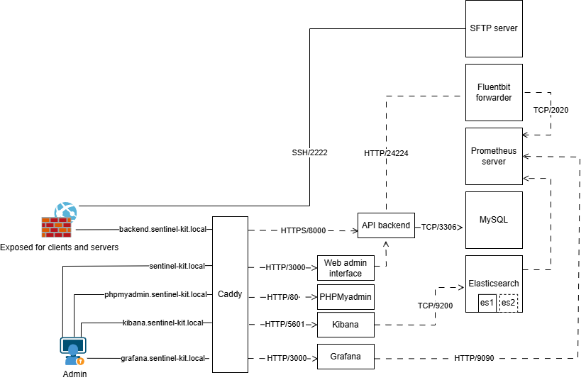

# 🛡️ Sentinel Kit Documentation

Welcome to **Sentinel Kit**, the unified security platform that simplifies SOC and DFIR operations through automated deployment and streamlined management.



---

## 🚀 Getting Started

New to Sentinel Kit? Start here:

1. **[Getting Started Guide](01-getting-started.md)**
   - Understanding `.env` central configuration file
   - Initial platform deployment using the launcher
   - Creating your first admin user
   - Accessing the platform components

2. **[Data Ingestion Setup](02-data-ingestion.md)**
   - Configure log sources and collection agents
   - Advanced datasource configuration for various data types
   - Monitor data ingestion health and performance

3. **[Sigma Rules Management](04-sigma-rules.md)**
   - Create custom detection rules using Sigma format
   - Import community detection rules
   - Rule testing and validation workflows

4. **[Alert Management & Investigation](05-alert-management.md)**
   - Alert triage and investigation procedures
   - Using the integrated dashboard vs Kibana
   - Response actions and case management

5. **[Monitoring & Health](06-monitoring-health.md)**
   - Platform health monitoring with Grafana
   - Service status checking and troubleshooting
   - Performance optimization guidelines

---

## 📋 Quick Reference

### Platform Access Points
- **Main Dashboard**: `https://sentinel-kit.local`
- **Kibana**: `https://kibana.sentinel-kit.local`
- **Grafana**: `https://grafana.sentinel-kit.local`

### Launcher Commands
```powershell
./launcher.ps1 start    # Start all services
./launcher.ps1 stop     # Stop all services  
./launcher.ps1 status   # Check service health
./launcher.ps1 logs     # View real-time logs
```

---

## 🎯 Platform Overview

Sentinel Kit integrates multiple security tools into a unified platform:

### Core Components
- **Detection Engine**: Sigma-based rule processing with Elastalert
- **Log Management**: FluentBit collection + Elasticsearch storage
- **User Interface**: Vue.js dashboard with integrated analysis tools
- **Monitoring**: Prometheus metrics + Grafana visualization

### Key Features
- **One-Command Deployment**: Complete platform setup with launcher scripts
- **Unified Dashboard**: Centralized security operations interface
- **Real-Time Detection**: Continuous log analysis with custom rules
- **Integrated Tools**: Native alert management + Kibana/Grafana integration
- **Scalable Architecture**: Microservices design for growth and customization

---

## 🆘 Support & Community

- **Documentation Issues**: Report via GitHub Issues with `documentation` label
- **Platform Bugs**: Use GitHub Issues with appropriate labels  
- **Feature Requests**: Discuss in GitHub Discussions
- **Security Issues**: Report privately to maintainers
